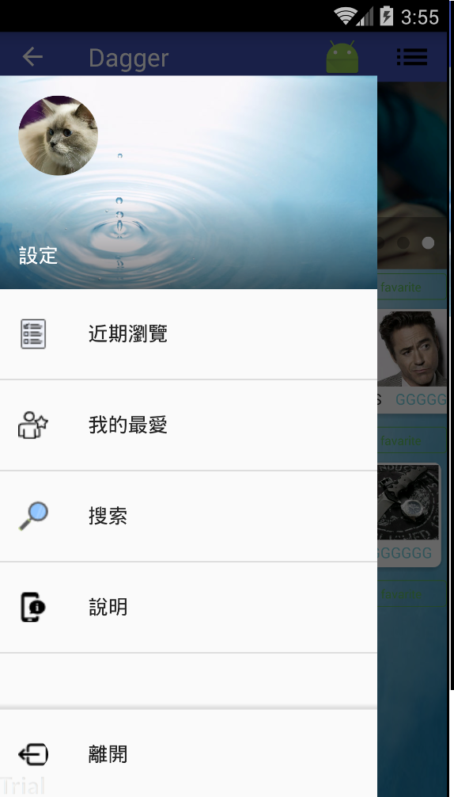
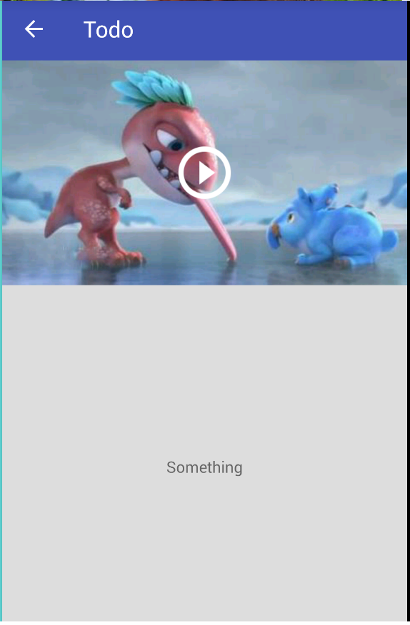

Android Sample
===================================

This sample demonstrates how to use video/ijkplayer and some other function tips. 
See below lists.

Introduction
------------

function: 
1.Dagger 
2.Retrofit2 
3.Butterknife 
4.Rxjava2 
5.ViewPagerIndicator 
6.Glide 
7.Cardview 
8.Gms 
9.ijkplayer 
10.sqlbrite 

etc.....

 

Pre-requisites
--------------

- Android SDK 25
- Android Build Tools v25.3.1
- Android Support Repository
- Backend service depended by you choose language,such like C#,JAVA...........

Screenshots
-------------

 
 
 

Getting Started
---------------

This sample uses the Gradle build system. To build this project, use the
"gradlew build" command or use "Import Project" in Android Studio.

Support
-------

 

License
-------

Copyright 2017 The Android Open Source Project, Inc.

Licensed to the Apache Software Foundation (ASF) under one or more contributor
license agreements.  See the NOTICE file distributed with this work for
additional information regarding copyright ownership.  The ASF licenses this
file to you under the Apache License, Version 2.0 (the "License"); you may not
use this file except in compliance with the License.  You may obtain a copy of
the License at

http://www.apache.org/licenses/LICENSE-2.0

Unless required by applicable law or agreed to in writing, software
distributed under the License is distributed on an "AS IS" BASIS, WITHOUT
WARRANTIES OR CONDITIONS OF ANY KIND, either express or implied.  See the
License for the specific language governing permissions and limitations under
the License.
